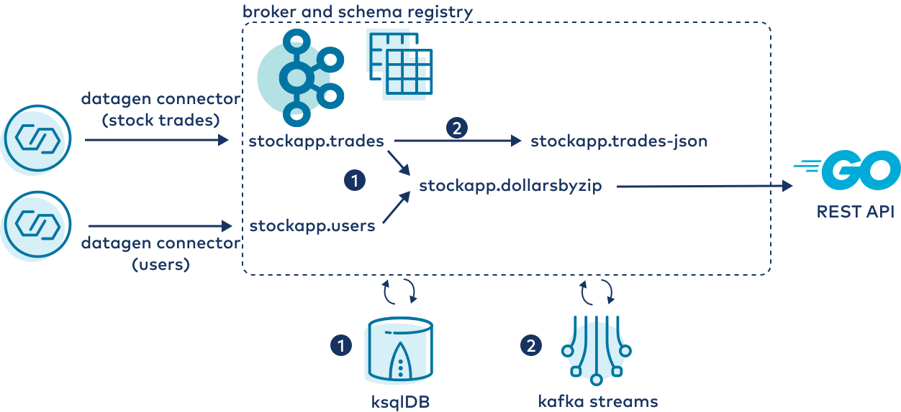
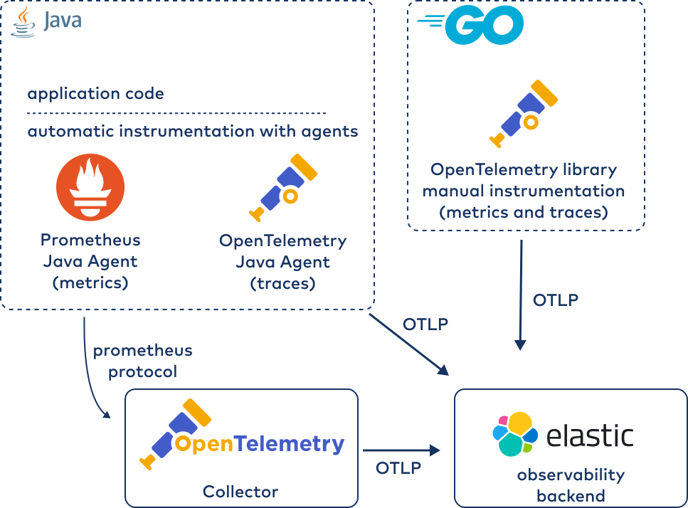

# Kafka Distributed Tracing

This repository is derived from the work of Nacho Munoz and Samir Hafez as described in the blog post [Integrating Apache Kafka Clients with CNCF Jaeger at Funding Circle Using OpenTelemetry](https://www.confluent.io/blog/integrate-kafka-and-jaeger-for-distributed-tracing-and-monitoring/).

In this example, you will observe metrics and traces for the following application architecture:



The observability architecture is as follows:



## Run in Gitpod

[](https://gitpod.io/#https://github.com/chuck-confluent/kafka-distributed-tracing)

## Prerequisites

1. Download OpenTelemetry Java Agent. This automatically instruments Java applications with tracing (should already be downloaded if using Gitpod).

    ```bash
    wget -P agents https://github.com/open-telemetry/opentelemetry-java-instrumentation/releases/download/v1.7.1/opentelemetry-javaagent-all.jar
    ```

1. Download Prometheus JMX Exporter. This automatically exports JMX metrics for Java services (should already be downloaded if using Gitpod).

    ```bash
    wget -P agents https://repo1.maven.org/maven2/io/prometheus/jmx/jmx_prometheus_javaagent/0.16.1/jmx_prometheus_javaagent-0.16.1.jar
    ```

1. Start the infrastructure stack with docker compose. Because of how dependencies are defined, this will start ZooKeeper, Kafka broker, Schema Registry, Kafka Connect, ksqlDB, ElasticSearch, Kibana, and Elastic APM server.

    ```bash
    docker-compose up -d connect ksqldb-server
    ```

1. Deploy the datagen connectors, which produce Avro records to Kafka.

    ```bash
    curl -X PUT -H "Content-type: application/json" -d @connectors/datagen-connector-trades.json http://localhost:8083/connectors/datagen-connector-trades/config

    curl -X PUT -H "Content-type: application/json" -d @connectors/datagen-connector-users.json http://localhost:8083/connectors/datagen-connector-users/config
    ```


1. Open ksqlDB CLI prompt.

    ```bash
    docker run --network kafka-distributed-tracing_default --rm --interactive --tty \
        -v ${PWD}/ksqldb_script.sql:/app/ksqldb_script.sql \
        confluentinc/ksqldb-cli:0.21.0 ksql \
        http://ksqldb-server:8088
    ```


1. Create streaming application in ksqlDB

    ```SQL
    ksql> run script /app/ksqldb_script.sql
    ```

1. Try a push query

    ```SQL
    SELECT * FROM stockapp_dollars_by_zip_5_min EMIT CHANGES;
    ```

1. Press `Ctrl+D` to exit the ksql shell.

1. Start the Kafka Streams and Go applications.

    ```bash
    docker-compose up -d kstream-service api-go-service
    ```

1. Start the OpenTelemetry collector and view the logs to see metrics being scraped from the Kafka Streams application.

    ```bash
    docker-compose up -d collector && docker-compose logs -f collector
    ```
    Exit the logs with `Ctrl-C`.

## View Metrics and Traces in the Elastic Observability Backend

1. Open http://localhost:5601 to see the Kibana UI.
    - In Gitpod, you can `Ctrl+Click` the URL output from the following command:
        ```bash
        echo https://5601-${GITPOD_WORKSPACE_URL#https://}
        ```
1. Navigate to the APM menu and view services, service map, traces, etc.
1. Navigate to the "discover" area to see metrics.

